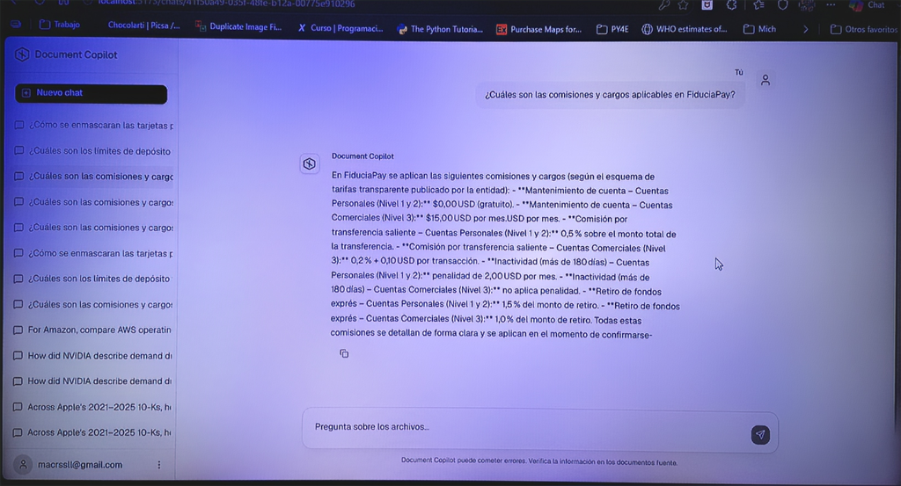

# Document Copilot — FiduciaPay


-F80000?style=for-the-badge&logo=oracle&logoColor=white)

**Document Copilot** es un asistente de inteligencia artificial interno de grado empresarial, diseñado específicamente para **FiduciaPay**. Su objetivo es permitir a analistas operativos, equipos de soporte técnico, oficiales de cumplimiento y desarrolladores consultar un corpus curado de documentos oficiales de la empresa en lenguaje natural y obtener **respuestas precisas, confiables y con citaciones textuales verificables en un clic**.

---

## 📋 Tabla de Contenidos

1. [Descripción General y Caso de Uso (FiduciaPay)](#1--descripción-general-y-caso-de-uso-fiduciapay)
2. [El Corpus Corporativo de FiduciaPay](#2--el-corpus-corporativo-de-fiduciapay)
3. [Arquitectura de la Solución](#3--arquitectura-de-la-solución)
4. [Tecnologías y Herramientas](#4--tecnologías-y-herramientas)
5. [Contrato del Producto: Cero Alucinaciones y Confianza Verificable](#5--contrato-del-producto-cero-alucinaciones-y-confianza-verificable)
6. [Ejemplos de Interacción](#6--ejemplos-de-interacción)
7. [Instrucciones de Uso (Guía Paso a Paso)](#7--instrucciones-de-uso-guía-paso-a-paso)
8. [Evidencia del Despliegue en la Nube (OCI)](#8--evidencia-del-despliegue-en-la-nube-oci)
9. [Estructura del Proyecto](#9--estructura-del-proyecto)

---

## 1. 🏢 Descripción General y Caso de Uso (FiduciaPay)

### ¿Quién es FiduciaPay?
**FiduciaPay** es una empresa transaccional de soluciones de pago y tecnología financiera (Fintech) que ofrece infraestructura de cobros, APIs para comercios electrónicos, gestión de contracargos, conciliaciones y seguridad bancaria.

### El Problema Operativo
Para operar eficientemente y cumplir con rigurosas normativas financieras, el equipo de FiduciaPay maneja miles de páginas de manuales regulatorios (como la normativa **PLD/FT** y **PCI-DSS**), guías de integración de APIs de pago, tarifarios e instructivos operativos.
* Antes de este proyecto, los analistas y especialistas de soporte pasaban **hasta el 50% de su semana** buscando manualmente en archivos PDF qué cláusula aplicaba a un contracargo, qué endpoint resolvió un código de error o cuál era la política de monitoreo transaccional.
* Esta tarea manual era repetitiva, propensa a errores y generaba cuellos de botella en la atención a comercios y auditorías.

### La Solución: Document Copilot
Document Copilot transforma la base de conocimiento interna de **FiduciaPay** en un asistente conversacional avanzado:
* **Lenguaje natural y en español latinoamericano:** Permite formular preguntas complejas sobre procedimientos, códigos de error o cumplimiento.
* **Citas 100% auditables:** Cada afirmación va acompañada de un marcador de cita `[n]` que indica el documento oficial, la sección y la página exacta.
* **Panel de verificación de pasajes:** Al hacer clic en una cita, la interfaz despliega el extracto original del PDF para una audición instantánea sin abandonar el chat.

---

## 2. 📂 El Corpus Corporativo de FiduciaPay

A diferencia de sistemas generalistas, este asistente está estrictamente delimitado a los **12 documentos oficiales corporativos** de FiduciaPay alojados en `data/downloads/`:

| Archivo PDF | Descripción y Alcance Operativo |
| :--- | :--- |
| `faq_transacciones.pdf` | Preguntas frecuentes sobre conciliaciones, tiempos de liquidación y disputas transaccionales. |
| `guia_integracion_api_pagos.pdf` | Especificaciones técnicas, webhooks, autenticación y códigos de error para desarrolladores. |
| `guia_operaciones_soporte.pdf` | Protocolos de escalamiento, SLA de atención y soporte al cliente. |
| `manual_operaciones_documentales.pdf` | Procedimientos de incorporación de afiliados (Onboarding), validación de identidad y expediente digital. |
| `manual_pld_ft_v1.pdf` | **Manual PLD/FT**: Prevención de Lavado de Dinero y Financiamiento al Terrorismo (KYC, operaciones inusuales). |
| `politica_prevencion_fraude.pdf` | Estrategias corporativas de monitoreo transaccional, reglas antifraude y bloqueo preventivo. |
| `politica_privacidad.pdf` | Protección y tratamiento de datos personales de comercios y usuarios finales. |
| `politica_seguridad_pci_dss.pdf` | Estándar de seguridad de datos para la industria de tarjetas de pago (**PCI-DSS**), criptografía y accesos. |
| `portafolio_servicios_acceso.pdf` | Descripción comercial y operativa del catálogo de productos y plataformas de FiduciaPay. |
| `tarifas_comisiones.pdf` | Estructura de comisiones por transacción, cuotas de mantenimiento, contracargos y tasas de liquidación. |
| `terminos_condiciones_usuario_final.pdf` | Marco legal aplicable a tarjetahabientes y compradores finales en la pasarela de pagos. |
| `terminos_uso.pdf` | Condiciones generales de uso de las APIs, portal comercial y herramientas administrativas. |

---

## 3. 🏗️ Arquitectura de la Solución

El sistema implementa una arquitectura **RAG Híbrida (Retrieval-Augmented Generation)** de baja latencia con separación de responsabilidades clara entre frontend, backend, base de datos e inteligencia artificial.

```mermaid
flowchart LR
    user["👤 Analista / Operador"] --> browser["💻 Browser (SPA)<br/>React 18 + Vite + Tailwind"]

    subgraph oci["☁️ Oracle Cloud Infrastructure (OCI)"]
        frontend["⚡ Frontend Service<br/>Vite Build"]
        backend["🚀 Backend Service<br/>FastAPI + PydanticAI"]
    end

    subgraph supabase["🗄️ Supabase Postgres"]
        auth["🔐 Supabase Auth<br/>(JWT / Email)"]
        db[("📊 Base de Datos<br/>• pgvector (vector 2048)<br/>• Full-Text Search (tsvector)<br/>• Chats y Citaciones")]
    end

    subgraph llm["🧠 Modelos de IA"]
        embed["OpenRouter / OpenAI<br/>(Embeddings 2048 dims)"]
        llm_engine["LLM Engine<br/>(OpenAI / Groq Fallback)"]
    end

    frontend -->|Sirve UI| browser
    browser -->|Auth Session| auth
    auth -->|JWT Token| browser
    browser -->|Stream Chat (SSE)| backend
    backend -->|Verify JWT| auth
    backend -->|Búsqueda Híbrida Concurrente<br/>(RRF - pgvector + tsvector)| db
    backend -->|Embeddings Query| embed
    backend -->|Orquestación Agente (PydanticAI)| llm_engine
    backend -->|Deltas + Metadata Citas| browser
```

### Componentes Clave de la Arquitectura

1. **Búsqueda Híbrida Concurrente (Hybrid Retrieval):**
   * **Búsqueda Semántica (`pgvector`):** Vectores de 2048 dimensiones generados con los modelos de embeddings configurados. Utiliza un índice HNSW sobre `halfvec(2048)` para búsquedas ultrarrápidas y superar límites de dimensionalidad.
   * **Búsqueda Léxica (Full-Text Search):** Utiliza columnas `tsvector` nativas de Postgres configuradas para idioma **español** (`spanish`), garantizando coincidencias exactas en códigos técnicos, siglas (ej. *PCI-DSS*, *PLD/FT*) y números de artículo.
   * **Fusión de Ranking RRF (Reciprocal Rank Fusion):** Combina y normaliza las puntuaciones semánticas y léxicas de forma concurrente (`asyncio.gather`) para obtener los fragmentos más relevantes.
2. **Orquestación del Agente (PydanticAI):**
   * El agente se ejecuta en el backend con tipado riguroso (`DocumentAgentDeps`, `GroundedAnswer`).
   * **Herramientas (Tools) del Agente:** El modelo dispone de herramientas nativas para investigar el corpus: `search_filings` (búsqueda híbrida inicial), `read_chunk` / `read_chunks` (lectura por lotes de fragmentos específicos) y `read_surrounding_chunks` (contexto adyacente).
3. **Resiliencia Multi-Modelo y Streaming SSE:**
   * Implementa el protocolo **AI SDK v5 Server-Sent Events (SSE)**, enviando deltas de texto en tiempo real junto con partes de metadatos de citación.
   * Dispone de un mecanismo de respaldo automático (*fallback*) que alterna entre modelos compatibles de OpenRouter y Groq en caso de saturación o errores de proveedor.
4. **Seguridad y Aislamiento por Tenant:**
   * Autenticación mediante **Supabase Auth** con validación de tokens Bearer JWT en FastAPI (`401 Unauthorized` si el token expira o falta).
   * Políticas de Seguridad a Nivel de Fila (**RLS - Row Level Security**) en Postgres para que un analista solo tenga acceso a sus propias conversaciones y auditorías.

---

## 4. 🛠️ Tecnologías y Herramientas

El proyecto sigue una política estricta de dependencias: se prefiere código propio, limpio y modular frente a librerías excesivas.

### Backend (FastAPI Service)
| Tecnología | Versión | Propósito Técnico |
| :--- | :--- | :--- |
| **Python** | 3.12+ | Entorno de ejecución de alto rendimiento para el backend y scripts de ingesta. |
| **FastAPI** | 0.115+ | Framework API REST asíncrono; expone endpoints de chat streaming, salud (`/health`) e ingesta. |
| **Uvicorn** | 0.32+ | Servidor ASGI de producción para manejar streams SSE concurrentes. |
| **PydanticAI** | 0.0.19+ | Orquestación del agente inteligente con validación estricta de esquemas y dependencias. |
| **SQLAlchemy + Alembic** | 2.0+ / 1.14+ | ORM y control de migraciones del esquema de base de datos en Postgres. |
| **structlog** | 24.4+ | Bitácoras estructuradas de alto nivel para trazabilidad y depuración de turnos en producción. |
| **uv** | Última | Gestor de paquetes ultrarrápido para Python (reemplaza a pip/poetry). |

### Frontend (React SPA)
| Tecnología | Versión | Propósito Técnico |
| :--- | :--- | :--- |
| **React + TypeScript** | 18+ / 5.6+ | Biblioteca principal e inferencia de tipos completa de extremo a extremo. |
| **Vite** | 6+ | Empaquetador y servidor de desarrollo de arranque instantáneo. |
| **Tailwind CSS + shadcn/ui** | 3.4+ / Radix UI | Sistema de diseño profesional, modo oscuro y componentes accesibles (chips de cita, paneles modales). |
| **Vercel AI SDK (@ai-sdk/react)** | 4.0+ / v5 SSE | Gestión reactiva de mensajes del chat, estado de transmisión en vivo y renderizado incremental. |
| **React Router DOM** | 7+ | Enrutamiento protegido entre inicio de sesión, listado de chats e hilos activos. |

### Datos, Embeddings e Ingesta
| Tecnología | Versión | Propósito Técnico |
| :--- | :--- | :--- |
| **Supabase Postgres** | Postgres 15+ | Almacenamiento persistente, RLS y extensiones vectoriales. |
| **pgvector** | 0.8+ | Extensión de Postgres para búsqueda vectorial con índices **HNSW** (`halfvec(2048)`). |
| **Docling** | 2.15+ | Framework de conversión de archivos PDF a JSON estructurado manteniendo tablas y encabezados. |
| **OpenRouter / Groq / OpenAI** | SDK 1.58+ | Proveedores de inferencia LLM y generación de embeddings (ej. Nemotron-3, GPT-OSS). |
| **Oracle Cloud Infrastructure (OCI)** | Nube | Plataforma de despliegue en contenedores / cómputo para los servicios backend y frontend. |

---

## 5. 🔒 Contrato del Producto: Cero Alucinaciones y Confianza Verificable

El asistente no es un chatbot de propósito general; es una herramienta de auditoría e investigación transaccional. Para garantizar que ningún analista tome decisiones basadas en datos erróneos, el sistema aplica **3 reglas inquebrantables**:

```
+------------------------------------------------------------------------------------+
|                      CONTRATO DE GROUNDING DE FIDUCIAPAY                           |
+------------------------------------------------------------------------------------+
| 1. PROHIBIDO INVENTAR: Cada dato, tasa o procedimiento debe existir en el corpus.  |
| 2. CITACIÓN ESTRICTA:  Toda afirmación lleva marcadores [1], [2] correspondientes  |
|                        a los extractos originales recuperados por el retriever.    |
| 3. FALLA CONTROLADA:   Si no hay evidencia en los 12 PDFs, el agente responde      |
|                        explícitamente que no hay información en el corpus.         |
+------------------------------------------------------------------------------------+
```

* **Validación en Backend (`grounding/validator.py`):** Antes de enviar el paquete final al cliente, el backend verifica que todas las citas del array `citations` correspondan exactamente a `chunk_id` devueltos en esa sesión y que contengan un extracto (`excerpt`) real.
* **Panel de Pasajes Originales (Trust UI):** En la interfaz del frontend, el analista hace clic en la píldora de citación (por ejemplo, *`manual_pld_ft_v1.pdf — Pág. 14`*) y el panel derecho despliega el texto exacto tal y como fue redactado en el manual institucional.

---

## 6. 💬 Ejemplos de Interacción

A continuación se presentan **ejemplos reales** del comportamiento de Document Copilot ante diferentes tipos de consultas operativas de **FiduciaPay**.

### Ejemplo 1: Consulta de Cumplimiento Normativo (PLD/FT)
> **👤 Usuario (Analista de Cumplimiento):**  
> ¿Qué señales de alerta u operaciones inusuales debemos monitorear durante la incorporación de un nuevo comercio según el manual de prevención de lavado de dinero?

> **🤖 Document Copilot:**  
> Durante el proceso de incorporación (*onboarding*) de un comercio, el manual de PLD/FT instruye monitorear las siguientes señales de alerta de operaciones inusuales:
> 
> 1. **Inconsistencias documentales:** Empresas de reciente creación que reportan volúmenes de transacción extraordinarios sin justificación comercial respaldada `[1]`.
> 2. **Estructuración del capital o socios:** Personas morales con estructuras societarias indebidamente complejas que dificultan identificar al beneficiario controlador o propietario real `[1]`.
> 3. **Renuencia del cliente:** Negativa o retraso reiterado del comercio para proporcionar documentación obligatoria del expediente de identificación KYC `[2]`.
> 
> **📚 Citaciones verificables en el panel:**  
> * `[1]` **manual_pld_ft_v1.pdf** — Sección: *4.2 Criterios e Identificación de Operaciones Inusuales* (Página 12)  
>   *Extracto:* *"Se considerarán señales de alerta en el onboarding: estructuras societarias opacas que impidan determinar el beneficiario controlador y proyecciones transaccionales incongruentes..."*  
> * `[2]` **manual_pld_ft_v1.pdf** — Sección: *5.1 Política de Conocimiento del Cliente (KYC)* (Página 18)

---

### Ejemplo 2: Consulta Técnica de Integración (API de Pagos)
> **👤 Usuario (Soporte Técnico de Integración):**  
> Un comercio reporta recibir el código de error `ERR_TX_402` al intentar procesar un cobro. ¿Qué significa y cómo se debe resolver según las guías técnicas?

> **🤖 Document Copilot:**  
> De acuerdo con la Guía de Integración de la API de Pagos, el código `ERR_TX_402` se describe de la siguiente manera:
> 
> * **Causa principal:** La transacción fue declinada por el banco emisor debido a **fondos insuficientes o límite de crédito excedido** por parte del tarjetahabiente `[1]`.
> * **Acción de mitigación o respuesta recomendada:** El comercio debe capturar la excepción y mostrar al comprador un mensaje amable invitándolo a utilizar un método de pago alternativo. No se recomienda reintentar el cobro automáticamente sin intervención del usuario para evitar bloqueos por reintentos excesivos `[1]`.
> 
> **📚 Citaciones verificables en el panel:**  
> * `[1]` **guia_integracion_api_pagos.pdf** — Sección: *8. Códigos de Estado y Errores de API* (Página 24)  
>   *Extracto:* *"ERR_TX_402: Declinada por fondos insuficientes en la cuenta emisora. Acción: Notificar al comprador y solicitar otra forma de pago. Prohibido el reintento automático en bucle..."*

---

### Ejemplo 3: Consulta Comercial sobre Esquema Tarifario
> **👤 Usuario (Ejecutivo de Operaciones):**  
> ¿Cuál es la comisión estándar por contracargo no favorable y en qué plazo se le descuenta a la cuenta del afiliado?

> **🤖 Document Copilot:**  
> Según el esquema tarifario vigente de FiduciaPay:
> 
> * **Comisión por contracargo:** Se aplica un cargo administrativo fijo de **$25.00 USD (o su equivalente en moneda local más IVA)** por cada disputa declarada como perdida o no favorable ante la marca bancaria `[1]`.
> * **Plazo de aplicación:** El descuento se realiza de manera automática de la liquidación inmediata siguiente del afiliado una vez emitido el fallo del banco adquirente `[2]`.
> 
> **📚 Citaciones verificables en el panel:**  
> * `[1]` **tarifas_comisiones.pdf** — Sección: *3.2 Gestión de Contracargos y Disputas* (Página 7)  
> * `[2]` **faq_transacciones.pdf** — Sección: *2. Tiempos de Corte y Liquidación* (Página 4)

---

### Ejemplo 4: Consulta Fuera del Alcance del Corpus (Demostración de Cero Alucinación)
> **👤 Usuario (Analista Jr.):**  
> ¿Cuál es la proyección de precio para el bitcoin en los próximos seis meses según los reportes de mercado de FiduciaPay?

> **🤖 Document Copilot:**  
> No hay información disponible sobre esto en el Corpus institucional de FiduciaPay.
> 
> *(Nota: El sistema evalúa el corpus, detecta que los 12 documentos oficiales no abordan proyecciones cripto ni cotizaciones bursátiles de terceros, activa el flag `insufficient_evidence: true` y omite generar respuestas especulativas).*

---

## 7. 🚀 Instrucciones de Uso (Guía Paso a Paso)

Esta sección está redactada especialmente para que cualquier desarrollador o analista en entrenamiento pueda configurar, instalar y ejecutar el proyecto localmente sin fricción.

### Paso 1: Verificación de Prerrequisitos
Asegúrate de tener instaladas las siguientes herramientas en tu sistema operativo (Windows, macOS o Linux):

| Herramienta | Versión | Comando de Verificación | Guía de Instalación |
| :--- | :--- | :--- | :--- |
| **Python** | 3.12 o superior | `python --version` | [python.org](https://www.python.org/downloads/) |
| **uv** | Última versión | `uv --version` | `curl -LsSf https://astral.sh/uv/install.sh | sh` (o [astral.sh](https://docs.astral.sh/uv/)) |
| **Node.js** | 20+ (LTS) | `node -v` | [nodejs.org](https://nodejs.org/) (se recomienda NVM) |
| **pnpm** | 8+ | `pnpm --version` | `corepack enable && corepack prepare pnpm@latest --activate` |
| **Git** | Última versión | `git --version` | [git-scm.com](https://git-scm.com/) |

Además, requerirás:
1. Una cuenta activa en [Supabase](https://supabase.com/) con un proyecto vacío de PostgreSQL.
2. Una clave de API válida de [OpenRouter](https://openrouter.ai/) y/o [OpenAI](https://platform.openai.com/api-keys) para la generación de respuestas y embeddings.

---

### Paso 2: Clonar el Repositorio y Configurar el Entorno

1. Clona el proyecto y accede a la raíz:
   ```bash
   git clone https://github.com/<tu-usuario>/document-copilot.git
   cd document-copilot
   ```

2. Configura las variables de entorno para el **Backend** creando el archivo `backend/.env` (puedes basarte en las instrucciones de `docs/guides/backend-setup.md`):
   ```ini
   # backend/.env
   # Cadena de conexión directa a Supabase PostgreSQL (con sslmode=require)
   DATABASE_URL="postgresql+psycopg2://postgres.<project_id>:<password>@aws-0-<region>.pooler.supabase.com:6543/postgres?sslmode=require"
   
   # Credenciales de Supabase
   SUPABASE_URL="https://<project_id>.supabase.co"
   SUPABASE_SERVICE_ROLE_KEY="ey..."
   
   # Claves LLM & Embeddings (OpenAI / OpenRouter / Groq)
   OPENAI_API_KEY="sk-..."
   OPENROUTER_API_KEY="sk-or-..."
   
   # Configuración API
   ALLOWED_ORIGINS='["http://localhost:5173", "http://127.0.0.1:5173"]'
   ```

3. Configura las variables de entorno para el **Frontend** creando el archivo `frontend/.env` (o `.env.local`):
   ```ini
   # frontend/.env
   VITE_API_BASE_URL="http://localhost:8000"
   VITE_SUPABASE_URL="https://<project_id>.supabase.co"
   VITE_SUPABASE_ANON_KEY="ey..."
   ```

---

### Paso 3: Inicializar la Base de Datos con Alembic

El esquema completo (tablas para usuarios, conversaciones, documentos de FiduciaPay, chunks e índices vectoriales HNSW) se administra de manera controlada mediante migraciones de SQLAlchemy y Alembic.

1. Desde el directorio raíz del proyecto, ejecuta la sincronización de migraciones hacia Supabase usando `uv`:
   ```bash
   uv run alembic -c backend/alembic.ini upgrade head
   ```
2. *Verificación:* En tu panel del proyecto en Supabase, confirmarás que se crearon las tablas `source_documents`, `document_chunks`, `chat_threads`, `chat_messages`, `message_citations` y `uploaded_documents`, así como las columnas con extensión `vector(2048)` y `tsvector` en español.

---

### Paso 4: Ingestar el Corpus Corporativo de FiduciaPay

Los 12 manuales institucionales de FiduciaPay ubicados en `data/downloads/` deben ser procesados por el pipeline inteligente para generar sus representaciones Docling JSON, dividir sus fragmentos (*chunking*) y calcular los embeddings semánticos.

1. Ejecuta el script de conversión e ingesta:
   ```bash
   uv run data/ingest_docling_documents.py
   ```
2. **¿Qué sucede internamente durante la ingesta?**
   * El script lee el manifiesto de conversión (`data/doclingdocuments/manifest.json`).
   * Convierte y limpia los párrafos, tablas legales y listados de cada manual corporativo.
   * Crea los registros en la tabla `source_documents`.
   * Genera fragmentos semánticos (máximo 800 tokens) mediante Docling HybridChunker y genera sus embeddings de 2048 dimensiones.
   * Inserta los fragmentos en `document_chunks` y actualiza la columna índice `search_vector` de Postgres para la búsqueda por palabras clave en español.

---

### Paso 5: Iniciar en Desarrollo Local (Backend + Frontend)

Para desarrollar, probar o hacer demostraciones, ejecuta ambos servicios en terminales independientes:

#### Terminal 1: Servidor Backend FastAPI
```bash
# Iniciar servidor Uvicorn con recarga automática
uv run uvicorn app.main:app --app-dir backend --reload --port 8000
```
* Verificar salud del backend en: `http://localhost:8000/health` (debe devolver `{"status": "ok"}`).

#### Terminal 2: Servidor Frontend Vite + React
```bash
cd frontend
pnpm install
pnpm dev
```
* La aplicación estará lista en: **`http://localhost:5173`**.
* Inicia sesión con tu correo (el registro en Supabase Auth con solo email te otorgará acceso instantáneo en modo desarrollo).

---

## 8. ☁️ Evidencia del Despliegue en la Nube (OCI)

Para cumplir con la validación en la nube del desafío **"Alura Agente"**, Document Copilot está configurado para desplegarse de manera escalable y profesional utilizando servicios de **Oracle Cloud Infrastructure (OCI)** en conjunto con la infraestructura administrada de **Supabase PostgreSQL**.

### Topología del Despliegue en OCI
* **Frontend Service (OCI Compute / Container Engine):** Contenedor o servidor web estático sirviendo el compendio compilado (`pnpm build`) de la aplicación React SPA, configurado para comunicarse encriptadamente con la API.
* **Backend Service (OCI Compute Instance / OKE):** Servicio Python sin estado corriendo en Uvicorn detrás de un proxy inverso (Nginx / OCI Load Balancer), consumiendo el servicio vectorial en Supabase y las API externas de LLM con resiliencia en tiempo de ejecución.

### 🌐 Enlace de Acceso en Producción
Puedes acceder a la instancia activa de prueba del asistente en la nube mediante el siguiente enlace:

> 🔗 **Enlace Público de Demostración:** `https://fiduciapay-copilot.duckdns.org`  
>

### 📸 Captura de Pantalla del Sistema en Operación

A continuación se presenta la evidencia visual de **Document Copilot — FiduciaPay** en pleno funcionamiento, respondiendo consultas operativas reales del corpus institucional:



#### Lo que demuestra esta captura en operación:
1. **Consulta tarifaria en lenguaje natural:** El usuario realiza la pregunta *"¿Cuáles son las comisiones y cargos aplicables en FiduciaPay?"*.
2. **Respuesta 100% fundamentada en el corpus (`tarifas_comisiones.pdf`):** El agente extrae y estructura de manera transparente:
   * **Mantenimiento de cuenta:** Cuentas Personales (Nivel 1 y 2) gratuitas ($0,00 USD); Cuentas Comerciales (Nivel 3) $15,00 USD/mes.
   * **Comisión por transferencia saliente:** 0,5% en Cuentas Personales y 0,2% + $0,10 USD por transacción en Cuentas Comerciales.
   * **Reglas de inactividad:** Penalidad de $2,00 USD/mes tras 180 días sin actividad en cuentas personales.
   * **Retiros exprés:** Tasas del 1,5% para cuentas personales y 1,0% para comerciales.
3. **App Shell y Barra Lateral de Historial:** En la barra izquierda se observan conversaciones previas sobre enmascaramiento de tarjetas, límites de depósito y consultas corporativas, evidenciando la gestión de sesiones en Supabase Auth y persistencia multi-hilo en la base de datos PostgreSQL.

---

## 9. 🗂️ Estructura del Proyecto

El repositorio está organizado en módulos pequeños, claros y predecibles, evitando abstracciones innecesarias y favoreciendo la legibilidad:

```text
document-copilot/
├── AGENTS.md                   # Fuente de verdad de reglas de arquitectura y desarrollo
├── README.md                   # Este documento técnico (FiduciaPay)
├── backend/                    # Servicio REST API Python + FastAPI + PydanticAI
│   ├── app/
│   ├── app/main.py             # Punto de entrada FastAPI, CORS y endpoints de salud
│   ├── app/config.py           # Gestión centralizada de variables de entorno (fail-fast)
│   ├── app/auth/               # Dependencias de seguridad (validación de JWT Bearer)
│   ├── app/database/           # Conectores Supabase y modelos SQLAlchemy (users, chats, chunks)
│   ├── app/retrieval/          # Búsqueda híbrida (queries pgvector + full-text y RRF fusion)
│   ├── app/assistant/          # Instrucciones del agente y definiciones PydanticAI
│   ├── app/grounding/          # Validador estricto de citaciones y extractos
│   └── app/chat/               # Orquestación de turnos y generador SSE streaming
├── frontend/                   # Interfaz de usuario SPA React 18 + Vite + TypeScript
│   ├── src/lib/                # Clientes Supabase y HTTP con inyección automática de JWT
│   ├── src/components/         # Componentes modulares (App Shell, Chat Shell, Trust UI)
│   ├── src/pages/              # Páginas de Login, Registro e Hilos de conversación
│   └── src/i18n/               # Internalización de interfaz (español por defecto)
├── data/                       # Corpus de FiduciaPay y scripts de conversión/ingesta
│   ├── downloads/              # Los 12 manuales institucionales oficiales en PDF
│   ├── doclingdocuments/       # Archivos JSON estructurados convertidos y manifest.json
│   ├── convert_pdfs_to_docling.py # Pipeline de transformación PDF -> JSON
│   └── ingest_docling_documents.py # Script principal de ingesta, chunking y embeddings
└── docs/                       # Especificaciones técnicas y guías complementarias
    ├── architecture.md         # Documento detallado de diseño del sistema
    └── guides/                 # Guías de configuración para Supabase, Backend y Frontend
```

---

## 🏆 Créditos y Agradecimientos
Desarrollado como parte de la entrega del proyecto integrador del desafío **"Alura Agente"** en el programa de formación **Alura ONE (Oracle Next Education)**.

* **Caso Corporativo:** FiduciaPay (Infraestructura de Pagos y Cumplimiento Fintech).
* **Idioma del Proyecto:** Español Latinoamericano.
